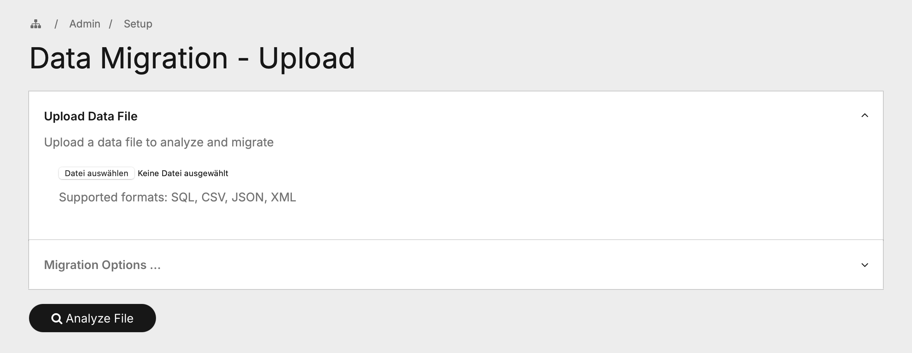
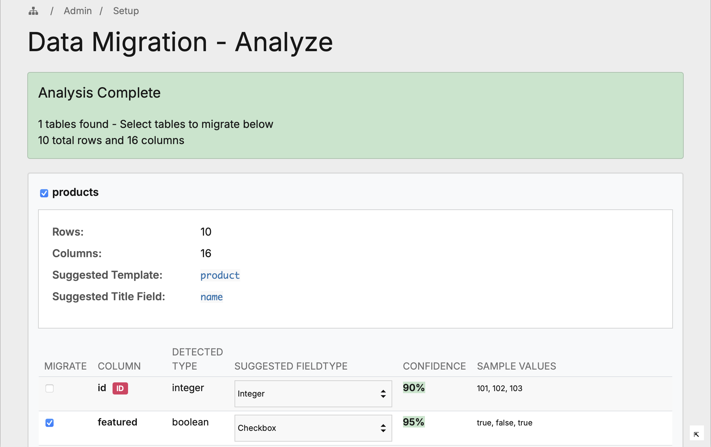
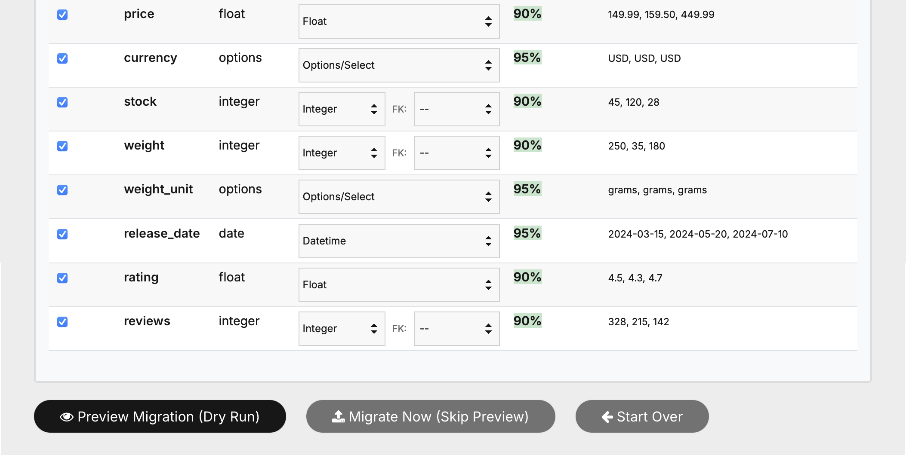
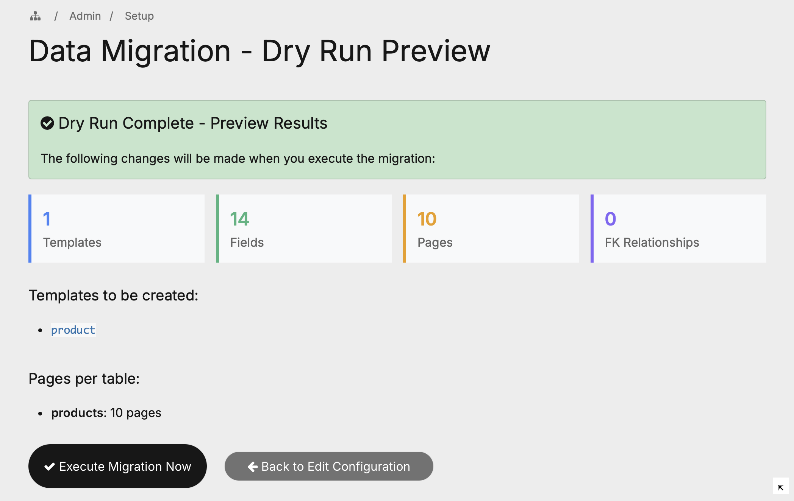
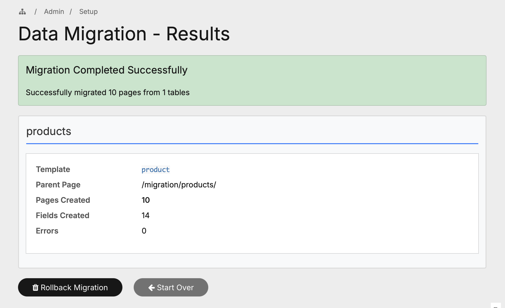

# ProcessWire Data Migrator

A Process module for migrating external data into ProcessWire's page structure. Supports SQL dumps, CSV, JSON, and XML files with automatic field type detection, foreign key handling, and complete rollback capability.

---

## Features

- **Multi-Format Parsing** — Import from `.sql`, `.csv`, `.json`, and `.xml` files
- **Smart Type Detection** — Automatically detects emails, URLs, dates, booleans, and more
- **Foreign Key Support** — Handles relationships between tables with dependency sorting
- **Dry Run Mode** — Preview all changes before committing to the database
- **Full Rollback** — Undo any migration with one click
- **Template Generation** — Creates ready-to-use PHP template files for your data

---

## Requirements

- ProcessWire 3.0.0 or newer
- PHP 7.4 or newer

---

## Installation

1. Download or clone this repository
2. Copy the `ProcessDataMigrator` folder to `/site/modules/`
3. In the ProcessWire admin, go to **Modules > Refresh**
4. Click **Install** for "Data Migrator"
5. Access the module at **Setup > Data Migrator**

```
/site/modules/ProcessDataMigrator/
```

---

## Usage

### Step 1: Upload Your Data File

Navigate to **Setup > Data Migrator** and upload your data file. The module automatically detects the format and parses the structure.


*Upload your SQL, CSV, JSON, or XML file. Configure sample size for large datasets.*

### Step 2: Review Analysis

After parsing, the module displays a detailed analysis of your data:

- Detected tables/collections
- Column types and suggested ProcessWire fieldtypes
- Sample values for verification
- Confidence scores for type detection


*Review detected tables, select which fields to import, and override fieldtypes if needed.*

### Step 3: Configure Field Mappings

Fine-tune the migration by:

- Selecting/deselecting individual fields
- Overriding suggested fieldtypes via dropdown
- Setting up Foreign Key relationships between tables


*Override fieldtypes and configure FK relationships using the inline dropdowns.*

### Step 4: Preview with Dry Run

Before executing the actual migration, run a dry run to see exactly what will be created:

- Number of templates and fields
- Number of pages per table
- FK relationship mappings


*The dry run shows a complete summary of all changes before any data is written.*

### Step 5: Execute & Rollback

Execute the migration to create all templates, fields, and pages. If something goes wrong, use the rollback feature to completely undo the migration.


*Migration results with rollback option. All created items can be removed with one click.*

---

## Supported Formats

### SQL (`.sql`)
Parses MySQL/MariaDB dump files including:
- `CREATE TABLE` statements for schema detection
- `INSERT INTO` statements for data extraction
- Column types, constraints, and foreign keys

### CSV (`.csv`)
Supports standard CSV files:
- Auto-detection of delimiter (comma, semicolon, tab)
- First row treated as header
- UTF-8 encoding

### JSON (`.json`)
Parses JSON structures:
- Arrays of objects
- Nested objects (flattened with dot notation)
- Multiple root-level collections

### XML (`.xml`)
Parses XML documents:
- Auto-detection of record elements
- Attribute extraction as fields
- Nested element flattening

---

## Field Type Detection

The module analyzes sample values to suggest appropriate ProcessWire fieldtypes:

| Detected Pattern | ProcessWire Fieldtype |
|------------------|----------------------|
| Email addresses | `FieldtypeEmail` |
| URLs (http/https) | `FieldtypeURL` |
| Dates (ISO, DE, US) | `FieldtypeDatetime` |
| Boolean (true/false, 0/1) | `FieldtypeCheckbox` |
| ENUM/SET values | `FieldtypeOptions` |
| Integers | `FieldtypeInteger` |
| Floats/Decimals | `FieldtypeFloat` |
| Long text (>255 chars) | `FieldtypeTextarea` |
| Short text | `FieldtypeText` |

All suggestions can be overridden in the analysis view.

---

## Generated Structure

For each imported table, the module creates:

```
/migration/
└── {table_name}/          # Parent page (template: {table}_list)
    ├── record-1/          # Child page (template: {table})
    ├── record-2/
    └── ...
```

**Templates created:**
- `{table}` — Detail template for individual records
- `{table}_list` — List template for the parent/overview page
- `migration-container` — Container template for the `/migration/` root

**Template files generated:**
- `/site/templates/{table}.php` — Ready-to-use detail template
- `/site/templates/{table}_list.php` — Ready-to-use list template

---

## Module Configuration

Access module settings at **Modules > Configure > Data Migrator**:

| Setting | Description |
|---------|-------------|
| Log Level | Control verbosity: ERROR, WARNING, INFO, or DEBUG |

Logs are written to `/site/assets/logs/data-migrator.txt`

---

## File Structure

```
ProcessDataMigrator/
├── ProcessDataMigrator.module.php    # Main module class
├── ProcessDataMigrator.info.json     # Module metadata
├── README.md
├── classes/
│   ├── parsers/
│   │   ├── AbstractParser.php        # Base parser class
│   │   ├── SqlParser.php             # SQL dump parser
│   │   ├── CsvParser.php             # CSV parser
│   │   ├── JsonParser.php            # JSON parser
│   │   └── XmlParser.php             # XML parser
│   ├── DataAnalyzer.php              # Analyzes parsed data
│   ├── TypeDetector.php              # Detects field types
│   ├── MappingEngine.php             # Creates field mappings
│   ├── TemplateCreator.php           # Creates templates/fields
│   ├── ImportProcessor.php           # Processes data import
│   ├── ImportRollback.php            # Handles rollback
│   └── Logger.php                    # Configurable logging
├── assets/
│   ├── css/
│   │   └── data-migrator.css
│   └── js/
│       └── table-field-checkboxes.js
└── sample-data/                      # Test files
    ├── customers.csv
    ├── orders.json
    └── products.xml
```

---

## Permissions

The module creates the permission `data-migrate`. Assign this permission to roles that should have access to the Data Migrator.

---

## Troubleshooting

**Large files timeout:**
Increase PHP's `max_execution_time` and `memory_limit`, or use the "Maximum Rows" option to limit the import.

**Wrong field type detected:**
Use the fieldtype dropdown in the analysis view to override any detection. The module learns from SQL column types when available.

**Circular FK dependencies:**
If tables have circular references (A → B → C → A), the module will detect this and show an error. Remove one FK mapping to break the cycle.

---

## License

This module is licensed under the MIT License.

---

## Links

- [ProcessWire](https://processwire.com/)
- [ProcessWire Modules Directory](https://processwire.com/modules/)
- [ProcessWire Forums](https://processwire.com/talk/)
